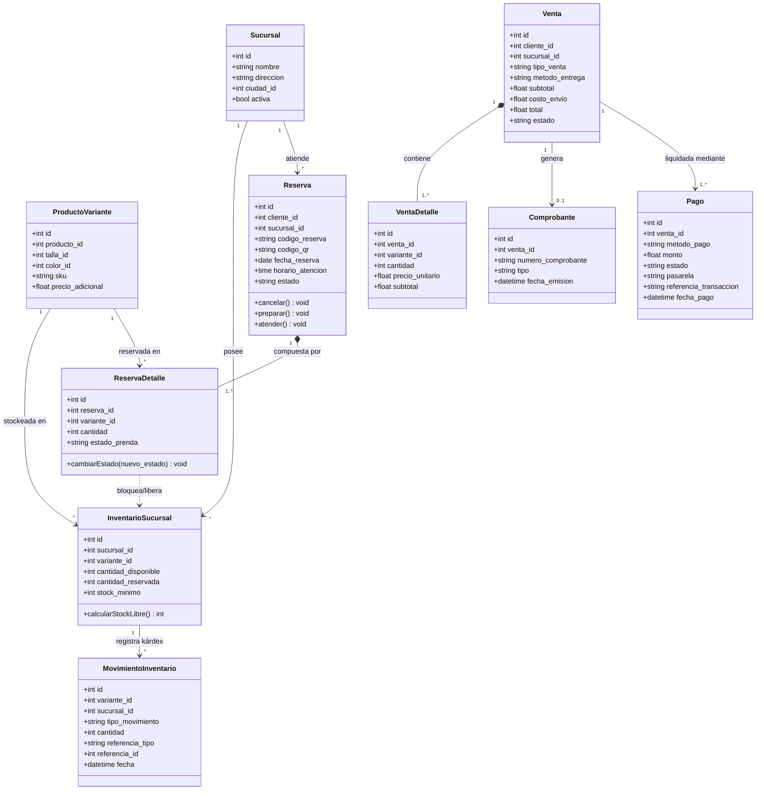
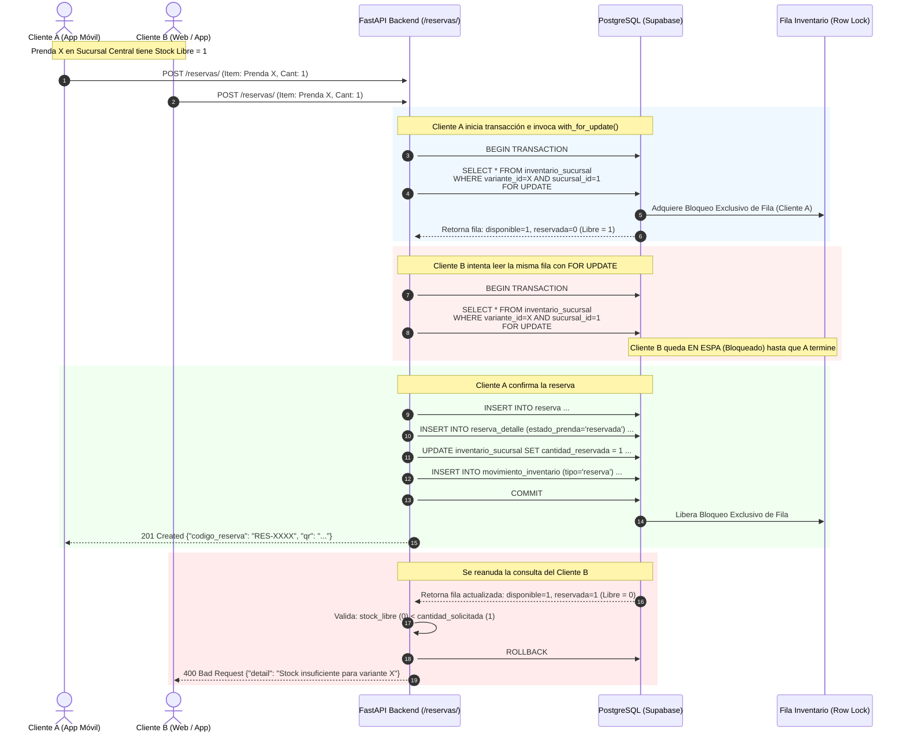
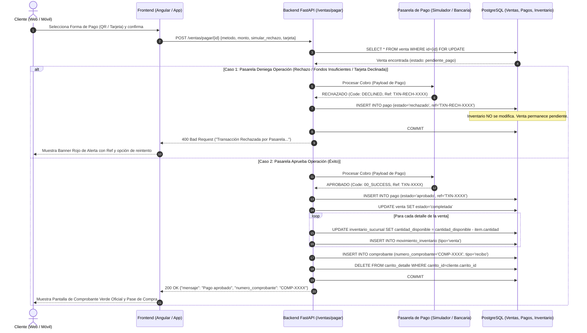

# Modelos UML 2.5 y Arquitectura del Sistema - FashionStore

Este documento contiene la especificación formal y los diagramas en **UML 2.5 (Mermaid)** para la defensa del proyecto, cubriendo el ciclo de vida de prendas, concurrencia en reservas, pasarela de pagos y gestión multi-sucursal.

---

## 1. Diagrama de Clases UML 2.5: Ciclo de Vida de Reserva, Inventario y Ventas

Este diagrama ilustra la estructura de datos que permite que **una misma reserva contenga prendas en diferentes estados** (`reservada`, `disponible`, `vendida`), así como la relación con el stock por sucursal y la pasarela de pagos.

### Explicación del Estado de Prenda en la Reserva:
- **`ReservaDetalle.estado_prenda`**:
  - `reservada`: Prenda apartada en el vestidor. El stock de la sucursal la contabiliza en `cantidad_reservada`.
  - `disponible`: La prenda fue probada por el cliente y descartada, o liberada anticipadamente. Se resta de `cantidad_reservada` y queda libre para otros clientes.
  - `vendida`: El cliente decidió quedarse con la prenda y comprarla en caja. Se descuenta de `cantidad_disponible` y se asienta el movimiento en el kárdex.

---

## 2. Diagrama de Secuencia UML 2.5: Concurrencia y Bloqueo Pesimista (`FOR UPDATE`)

Cómo el sistema evita que dos clientes puedan reservar simultáneamente la misma prenda cuando solo queda 1 unidad en stock.

---

## 3. Diagrama de Secuencia UML 2.5: Pasarela de Pagos (Flujo Aprobado vs Rechazado)

Muestra el procesamiento de cobros (QR Simple, Tarjeta y Efectivo) y cómo la pasarela devuelve la **aprobación o rechazo** de la transacción garantizando la integridad del inventario.

---

## 4. Respuestas Técnicas Concisas para la Mesa de Examen

1. **¿Cómo se diferencia si una prenda está disponible, reservada y vendida?**
   - Se maneja a nivel de `inventario_sucursal` (`cantidad_disponible` y `cantidad_reservada`), y a nivel de cada ítem en `reserva_detalle` con la columna `estado_prenda` (`'reservada'`, `'disponible'`, `'vendida'`).
   - El stock libre vendible se calcula estrictamente como:
     $$\text{Stock Libre} = \text{cantidad\_disponible} - \text{cantidad\_reservada}$$

2. **¿Cómo se evita que dos clientes reserven simultáneamente la misma prenda?**
   - Mediante **Bloqueo Pesimista en Base de Datos** (`SELECT ... FOR UPDATE` en PostgreSQL/SQLAlchemy: `inv = db.query(InventarioSucursal).filter(...).with_for_update().first()`).
   - La primera transacción que llega adquiere el lock a nivel de fila; la segunda espera a que la primera haga `COMMIT`. Al reanudarse la segunda, detecta que el stock libre es 0 y devuelve `400 Bad Request`.

3. **¿El cliente puede comprar desde la aplicación móvil y recibir confirmaciones?**
   - Sí, la API REST es 100% agnóstica para clientes Web y Móvil (`/api/v1/ventas/checkout` y `/api/v1/ventas/pagar`). Al completarse la compra, se genera el registro del comprobante fiscal oficial, se actualiza el estado de la venta y se devuelve el identificador de transacción bancaria.

4. **¿El stock puede ser diferente por sucursal y una reserva puede contener prendas reservadas, disponibles y vendidas?**
   - Sí. Cada registro en `inventario_sucursal` tiene clave compuesta (`sucursal_id`, `variante_id`), con stock independiente por tienda física.
   - En una reserva (`reserva_detalle`), cada ítem tiene su propio `estado_prenda`, permitiendo que dentro de una misma reserva una prenda esté ya aprobada/vendida, otra aún apartada/reservada en vestidor y otra probada/disponible. Todo respaldado en el Modelo UML de Clases anterior.

5. **¿Tienen probador de ropa en Realidad Aumentada?**
   - Sí, implementado en el catálogo con `Vestidor Virtual 3D/AR` utilizando Three.js y WebGL interactivo en tiempo real con rotación 360°, ajuste de escala y previsualización de texturas de tela sobre modelo anatómico.

6. **¿Recomendaciones por IA según cliente, temporada, talla o disponibilidad?**
   - Sí, a través del servicio `/ia/recomendaciones` y `/ia/alerta-reabastecimiento`. Considera el historial del cliente, las condiciones climáticas/temporada, la disponibilidad por sucursal y sugiere prendas afines y niveles óptimos de reposición.

7. **¿Formas de pago por QR, efectivo y tarjeta con aprobación y rechazo?**
   - Sí, pasarela multi-método (`qr`, `tarjeta_credito`, `efectivo`). Cuenta con simulación de transacciones aprobadas y rechazadas (por bandera bancaria o tarjeta declinada), registrando el estado del pago en la tabla `pagos` y protegiendo el inventario ante rechazos.
